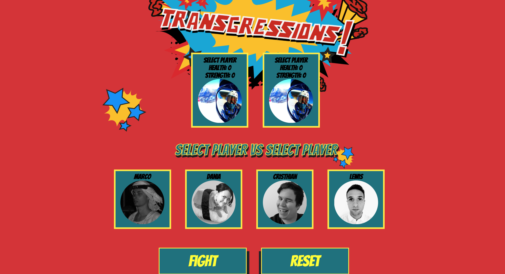
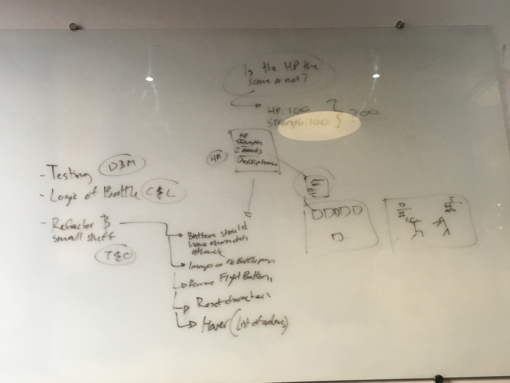

# Transgressions 🥊🎮

[How To Use](#how-to-use) | [Approach](#approach) | [Technologies](#technologies) | [Challenges](#challenges) | [MVP](#mvp) | [Other user stories](#other-user-stories) | [Team](#team)



**Transgressions** is a re-incarneted 'Tekken' battle game based on the October coding Cohort at Makers Academy. This was done with React as the front end, Rails as the back end, and the duration of this project was for a week. The project is called "Transgressions" based on a rule at Makers Academy.

My role in this project was supporting my pairs code both the front and back end. My main contribution was the appearance and UX design.
Warning: This game is not responsive yet, it'll only be perfectly CSS'ED' on a MacBook Pro 13inch. 


# How To Use

As this is the front-end of the project, it requires the api data from the other project linked here: https://github.com/LewisYoul/pokebattle
Once you have this downloaded and running (instructions are on the linked repo, follow the steps below!)

1. Clone repo into project
```
git clone https://github.com/tabrza/pokebattle-react.git
```

2. cd into the project
```
cd/pokebattle-react
```

3. Launch NPM: npm install
```
npm install
```

4. Start the Server! Make sure you have started the api server (instructions on the linked repo above)
```
npm start
```

~Enjoy!

# Approach

Inspired by a Tekken Game and our cohort members at Makers Academy, we initially drew out an MVP to setup the basics of what made our
game unique. From there, whilst working in pairs, we expanded into the other User stories we achieved (that is listed down below).



Here, we always had retros to write down the list of things to do for tomorrow and cherish the stuff that we did today. This is how the team stayed focused.

# Technologies

Front-End: React
 (Gems)
 - React-Sound
 - React-Toggle-Display

Back-End: Ruby On Rails
 - Responders


# Challenges

| Successes             | Challenges                  |
| --------------------- |:---------------------------:|
| Accomplished MVP      | Testing (Figuring out Jest) |
| Delegated teamwork    | Learning React in a short period of time         |
| Had a good time       | Having an explorative approach |


# MVP:

It was vital for us to create an MVP as we had to pinpoint what made our game unique. This was
our starting point/goal for building the project.

```
As a user,
So I can be engaged with the battle game,
I would like to see two characters on the screen
```

```
As a user,
So I can be start playing the battle game,
I would like to attack a player (and see a reaction)
```

```
As a user,
So I can be start playing the battle game,
I would like the attacked player to receive damage to their health bar  
```

## Other User Stories

Throughout the week, we branched off into accomplishing the following user stories. Although we
brainstormed many, these are the ones that were achieved during the week.

```
As a user,
So I can be start playing the battle game,
I would like to be able to select a player
```

```
As a user,
So I can play against another player
I would like to play against another player
```

```
As a user,
So I can choose my player wisely
I would like to see the details of the other player
```

```
As a user,
So I can play the game happily,
I would like to play the game that has a sexy interface
```

```
As a user,
So I can get in the mood to play a game,
I would like to have background music whilst playing the game.
```

```
As a user,
So I can choose to attack a player,
I would like to have more than one attack on the battle page.
```

```
As a user,
So I can see the damage the other player has costs me,
I would like to see the changed hp on the screen.
```

```
As a user,
So I can see I've attacked a player,
I would like to see some effect when I attack a player.
```

```
As a user,
So I can know when I lose a game,
I would like to see a GameOver Page.
```

```
As a user,
So I can play the game again,
I would like to be redirected to the character page again!
```

# Team  

- 🐿 [Cristhian Da Silva](https://github.com/cristhiandas)
- 🐱 [Dania Mah](https://github.com/thatdania)
- 🐸 [Lewis Youl](https://github.com/LewisYoul)
- 🐈 [Marco Vanali](https://github.com/Vanals)
- 🐻 [Oleg Grushetskyy](https://github.com/olegfkl)
- 🦅 [Tabish Raza](https://github.com/tabrza)
